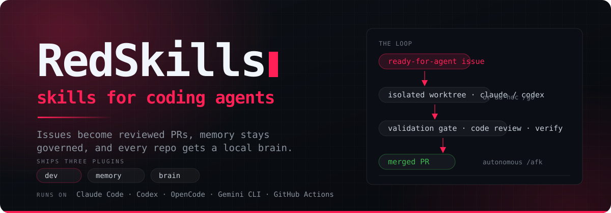
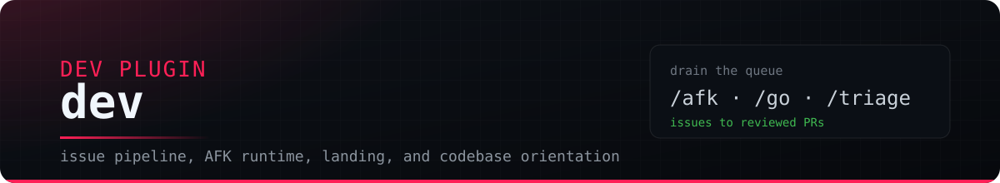
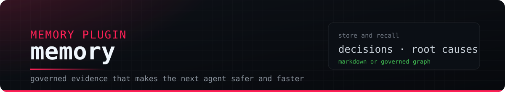
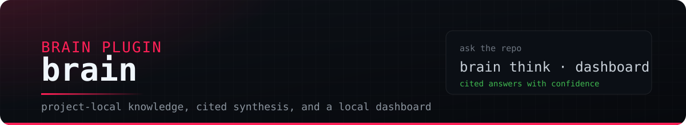

<div align="center">



<p>
  <a href="https://www.npmjs.com/package/@reddb-io/red-skills"></a>
  <a href="https://github.com/reddb-io/red-skills/actions/workflows/red-workspace-ci.yml"></a>
  <a href="LICENSE"></a>
  <a href=".claude-plugin/marketplace.json"></a>
</p>

<strong>The operating system for agentic engineering work.</strong><br>
RedSkills turns GitHub issues into reviewed PRs, remembers the operational
evidence that prevents repeated mistakes, and gives every repo a local knowledge
surface for Claude Code, Codex, OpenCode, Gemini CLI, Pi, and GitHub Actions.

</div>

---

RedSkills is reddb.io's plugin suite for serious code-agent workflows. It
started as a reddb.io adaptation of
[`mattpocock/skills`](https://github.com/mattpocock/skills): small `SKILL.md`
files that teach agents concrete behaviors. RedSkills keeps that core and adds
the pieces teams need when agents are doing real engineering work: issue
automation, isolated worktrees, autonomous execution, governed Memory, Brain,
MCP servers, release bundles, status signals, and guardrails.

One piece shapes everything else: a **host-scoped daemon** that owns every
agent process on the machine. Read
[The Execution Model](#the-execution-model) first — the rest of this document
assumes it.

Attribution is preserved in [NOTICE](./NOTICE).

## Contents

**Start here**

- [Core And Complementary](#core-and-complementary) — the one distinction the rest of this document obeys

**Core**

- [The Execution Model](#the-execution-model) — the host-scoped `redskilled` daemon
- [The Loop](#the-loop) — issue to reviewed PR
- [What Ships](#what-ships) — the `dev`, `memory`, and `brain` plugins

**Installing and using it**

- [Install](#install) — the mise/red-dev bootstrap
- [Quick Start](#quick-start) — bootstrap a repo and move work
- [Host Support](#host-support) — which agent host gets which surface

**Complementary**

- [Surfaces Over The Daemon](#surfaces-over-the-daemon) — herdr, VSCode, the statusline
- [Token-Efficient Terminal Work](#token-efficient-terminal-work) — `rsp`
- [GitHub Actions Lane](#github-actions-lane) — one autonomous attempt in CI
- [Container Lane](#container-lane) — AFK in a stateless Docker image

**Reference**

- [TOON And TOONL](#toon-and-toonl) — the serialization mandate and the repo-wide invariants
- [Configuration](#configuration) — `.red/config.yaml`
- [Repo Layout](#repo-layout) — what lives where
- [Skill Map](#skill-map) — every shipped skill
- [Development In This Repo](#development-in-this-repo) — building and testing RedSkills itself
- [License](#license)

## Core And Complementary

RedSkills has a **core** and a **complementary layer**, and telling them apart is
the fastest way to read this repository. The core is what makes an agent move
work: the plugins that teach it, the daemon that runs it, and the issue-to-PR
loop that governs it. Everything else is an **accelerator over that core** —
useful, independently installable, and never load-bearing for the loop itself.

**Core — remove any of these and work stops moving.**

| Piece | What it is | Where |
| --- | --- | --- |
| `dev`, `memory`, `brain` | The three marketplace plugins. Dev moves work, Memory improves agent execution, Brain preserves human-facing knowledge. | [What Ships](#what-ships) |
| `redskilled` | The host-scoped execution daemon. It owns the processes that do the work. | [The Execution Model](#the-execution-model) |
| The issue-to-PR loop | GitHub Issues as the work queue, isolated worktrees, gates, and review-gated landing. | [The Loop](#the-loop) |

**Complementary — remove any of these and the loop still runs, more slowly or
less visibly.**

| Piece | What it is | Where |
| --- | --- | --- |
| [`rsp`](./apps/rsp/README.md) | Token-efficient terminal wrappers over a reversible elision store, plus `rsp wait`. | [Token-Efficient Terminal Work](#token-efficient-terminal-work) |
| [`herdr-plugin`](./apps/herdr-plugin-redskilled/README.md) | A [herdr](https://herdr.dev) plugin pane reading the daemon: Workers, logs, events, PRs. | [Surfaces Over The Daemon](#surfaces-over-the-daemon) |
| [`vscode-extension-red-skills`](./apps/vscode-extension-redskilled/README.md) | A VSCode extension reading the same daemon from inside the editor. | [Surfaces Over The Daemon](#surfaces-over-the-daemon) |
| The statusline | The daemon's own one-line answer, rendered by the daemon and printed by the host. | [Surfaces Over The Daemon](#surfaces-over-the-daemon) |
| The Actions lane | One autonomous attempt per issue, from GitHub Actions, without a local daemon. | [GitHub Actions Lane](#github-actions-lane) |
| [`afk-container`](./apps/worker-container/README.md) | The same drain in a stateless Docker image. | [Container Lane](#container-lane) |
| [`code-nav`](./apps/mcp-navigator/README.md) | The LSP-backed `navigator` MCP server used by `dev` for codebase orientation. | [Repo Layout](#repo-layout) |
| [`red-browser`](./apps/mcp-browser) | Browser CLI and CDP driver for ground-truth verification of live apps. | [Repo Layout](#repo-layout) |

Two properties are neither core nor complementary — they are **house rules the
whole repo obeys**: structured data is TOON everywhere (files *and* wires), and
agent work happens in disposable worktrees while the primary checkout's branch
stays under human control. Both are enforced as ratchets, not conventions; see
[TOON And TOONL](#toon-and-toonl) and [Configuration](#configuration).

## The Execution Model

Without a shared host, every checkout ran its own execution plane. Each one sized itself
against the machine independently, so N repositories draining work at once spent
the same host budget N times and nothing on the machine knew the total.
[ADR 0130](./.red/adr/0130-redskilled-host-scoped-execution-daemon.md) replaced
that with one process.

**`redskilled` is the host-scoped execution daemon: exactly one singleton per
machine, behind a unix socket.** It owns Worker processes across every project
on that machine — birth, death, limits, and placement — while each project's
bundle keeps owning the work. A second OS user on the same machine is refused by
name rather than served from the first user's daemon (Amendment 3).

### The demand loop

There are exactly **two players**, and the loop belongs to the one that outlives
the session (Amendment 4):

```text
registration  ->  tracker poll  ->  admission  ->  birth
(project MCP)     (daemon)         (daemon)       (daemon)
```

| Step | Who | What actually happens |
| --- | --- | --- |
| **Registration** | The project's MCP, alive in a user's session | Hands over an opaque work selector, a launch template (argv + env), and a target. Renewed while the session lives, survives that session's end, lapses after a stated interval, and deregisters itself when the queue drains. |
| **Tracker poll** | The daemon | Reads queue depth for every registered project on one shared credential. GitHub quota is per token, so one aliased request for N projects is the saving that splitting the poller across N processes cannot make. |
| **Admission** | The daemon | Only it sees every project at once, so only it can decide how many Workers the host affords. A project asks; a smaller grant is an ordinary answer, recorded with the host's own reason. |
| **Birth** | The daemon | Launches the Worker into a resource unit of its own — a transient init-system unit, not a daemon child — substituting the four per-birth facts it owns (`{{worker_id}}`, slot, workspace, log path) into the launch template it was handed. |

The launch is **restated, not frozen** (Amendment 5): a tick that swapped the
runner sends the new argv/env pair on the renewal its session already sends, and
the daemon holds it as the launch for the *next* Worker. That is what lets a
drain start on `claude`, meet repeated deaths, and swap to `codex` without a new
op or a window where the host holds no record of a project that is still working.

### What the daemon refuses to know

Its contract is minimal and frozen: **argv, placement target, budget, opaque
project label — never repository layout.** It does not know what an Issue, a
label, a Spec, a gate or a Landing is. A selector is a string it carries, never a
sentence it reads. That refusal is load-bearing: it is what lets one daemon serve
checkouts pinned to different bundle versions, which dissolves bundle-version
skew rather than managing it.

Three properties follow, and they are the ones worth trusting:

- **It fails closed.** No daemon, no Worker. A launcher that cannot reach the
  daemon throws; there is no quiet local fallback, because a Worker a project
  starts itself is one no admission verdict judged — outside the host budget,
  absent from the host event lane, reported by no surface. The repo enforces this
  as a CI ratchet: a per-project module that can create a process fails
  `invariants:host-owns-birth`.
- **A restart costs none of it.** Workers are init-system units, so the daemon
  re-attaches by unit name and rehydrates identity and budget from its own
  append-only TOONL event lane. A stop is a restart, not an evacuation, and the
  daemon's `stop` command prints exactly what survives it.
- **Reach is asymmetric.** A session reads *every* project's Workers — diagnosing
  contention from wherever you happen to be is the problem the daemon exists to
  solve — and writes only its own. A refusal never distinguishes "no such Worker"
  from "not your Worker", so a session cannot map another project by guessing.

### The MCP is the interface

The `rs_dev` MCP server is the canonical **complete** interface to every
execution capability — project registration and status, worker dispatch, runner
steering, the gate, landing and cascade, claims, the worktree pool, hygiene,
observability, and the queue ([ADR 0120](./.red/adr/0120-red-castle-is-the-afk-mcp.md),
consolidated by [ADR 0123](./.red/adr/0123-boundary-consolidation-mcp-first-skills-and-pruned-castle.md)).
The CLI, `/afk`, `/go`, and every UI over the daemon are **clients of it**, never
owners of a capability the MCP lacks. Every tool wraps a value-returning
primitive rather than the print-and-exit command layer and returns TOON, so one
core answers both transports; mutating tools carry a `MUTATING:` prefix and are
announced before use.

### Provisioning

The daemon is always on: `provision` installs it as an OS service and starts it
through that service, and **no client ever starts one** — a client that finds no
daemon fails closed and prints this command (ADR 0150 §4). One command
establishes the machine and prints the audit; it is what `/red-setup` runs:

```bash
# The npm direct-run form is canonical (ADR 0091): it pins the version and works
# on every host. An installed `redskilled` shim on PATH is a warm-cache
# optimization, never a requirement.
RS="npx -y -p @reddb-io/red-skills@<version> red-skills-redskilled"

$RS provision                  # start the daemon, print the audit
$RS provision --check          # the read-only half — creates nothing, starts nothing
$RS provision --no-unit        # skip the OS service; keep the host's own arrangement
$RS statusline global          # every project's Workers, each showing its owner
$RS stop                       # stop the daemon; print what survives it
```

The operator-scoped home `~/.red/redskilled/` has exactly one creator —
`provisionRedskilledHome` (Amendment 2) — and is created only when a declared
workspace target reads it. It is *not* the checkout's `.red/`, whose sole
creator remains `/red-setup`; ADR 0067's authority is repository-scoped.
`/red-doctor` reports the same four checks (`home`, `daemon-entry`, `reach`,
`supervisor-unit`) read-only, probing the socket without ever spawning the daemon
it reports on.

Full detail: [apps/redskilled](./apps/redskilled/README.md).

## The Loop

**Issue to PR is the product.** RedSkills treats GitHub Issues as the work queue,
not a side note. `/triage`, `/to-spec`, `/to-tickets`, `/afk`, `/go`, `/hitl`, and
`/retake` all speak the same issue-state vocabulary, and **agents work in
disposable worktrees** so the primary checkout stays under human branch control.

```text
Plan -> Spec -> sliced issues -> ready-for-agent -> isolated worktree
  -> validation -> PR -> review/checks -> merge -> Memory evidence
```

The issue lifecycle is intentionally boring:

```text
needs-triage -> /triage -> ready-for-agent -> /afk -> PR/merge -> closed
                                |
                                +---- blocked/spec/validation/etc.
                                      -> ready-for-human -> /hitl or /retake
```

Important states:

| State | Meaning |
| --- | --- |
| `ready-for-agent` | The only issue state autonomous drainage consumes. |
| `running` | Timeline state while a Worker owns the issue. Live state is the daemon's. |
| `ready-for-human` | A human decision is needed before delegation is safe. |
| `blocked:dependency` | Waits on `req:N` labels and should not page a human. |
| `blocked:validation` / `blocked:spec` | Can be requeued only after retry guidance is already decided. |
| `blocked:ci` | The branch is pushed and the pull request is real, but the queue handed it back. |

### Landing in the merge-queue era

**The merge command exiting 0 is not the merge.** Under a merge queue — the
forge's own, or `--auto` — exit 0 means *enqueued*, so landing ends by asking the
pull request itself and treats only `state: MERGED` as landed. A queue that hands
the PR back parks `blocked:ci` with the issue open and the branch on origin;
nothing closes, relabels, deletes, or cascades before that confirmation.

CI is queue-aware on the other side of the same seam: a merge queue tests each
candidate on a temporary `gh-readonly-queue/*` branch and reports through the
`merge_group` event, so
[`red-workspace-ci.yml`](./.github/workflows/red-workspace-ci.yml) subscribes to
it. Without that trigger the required checks never report for a queued entry and
the queue accepts pull requests and then holds them forever.

## What Ships

Three plugins install from one marketplace. **One source tree, several hosts:**
Claude Code, Codex, Gemini CLI, OpenCode, Pi, GitHub Actions, MCP servers, and
the herdr dashboard are generated from or read the same plugin definitions and
runtime apps.

| Plugin | Job | Use it when |
| --- | --- | --- |
| [`dev`](./plugins/dev/.claude-plugin/plugin.json) | Engineering workflow: issue triage, autonomous execution, worktree safety, review-gated landing, process dashboards, runner policy, and codebase orientation. | You want an agent to plan, execute, review, or ship code work. |
| [`memory`](./plugins/memory/README.md) | Governed operational memory: decisions, validations, reasoning attempts, stale-claim checks, context packs, and skill telemetry evidence. | You want agents to stop repeating old mistakes after context resets. |
| [`brain`](./plugins/brain/README.md) | Project-local knowledge: typed artifacts, personal/project facts, sources, graph connections, search, cited answers, and dashboards. | You want durable knowledge the human may ask about later. |

Maintainer-only plugin:

| Plugin | Job | Use it when |
| --- | --- | --- |
| [`internal`](./plugins/internal/README.md) | Maintainer-only skills for operating this repository. Installable through the normal marketplace flow, but active only when `plugins.internal.enabled: true` is present. | You maintain `red-skills` itself. |

### Dev



`dev` owns the engineering workflow: issue pipeline, autonomous execution,
interactive landing, process visibility, setup/adoption checks, codebase
orientation, and three MCP servers — [`redskilled`](./plugins/dev/skills/engineering/afk/MCP.md),
[`navigator`](./apps/mcp-navigator/README.md), and [`rsp`](./apps/rsp/README.md).

Core responsibilities:

- Bootstrap RedSkills with [`red-setup`](./plugins/dev/skills/engineering/red-setup/SKILL.md).
- Maintain issue state with [`triage`](./plugins/dev/skills/engineering/triage/SKILL.md), [`to-spec`](./plugins/dev/skills/engineering/to-spec/SKILL.md), and [`to-tickets`](./plugins/dev/skills/engineering/to-tickets/SKILL.md).
- Execute delegable work with [`afk`](./plugins/dev/skills/engineering/afk/SKILL.md), or dispatch one concrete demand with [`go`](./plugins/dev/skills/engineering/go/SKILL.md).
- Land a hand-worked branch with [`retake`](./plugins/dev/skills/engineering/retake/SKILL.md) (the retired `ship` migrated there — ADR 0081).
- Resolve human gates with [`hitl`](./plugins/dev/skills/engineering/hitl/SKILL.md) or safe retries with [`retake`](./plugins/dev/skills/engineering/retake/SKILL.md).

Dev guard rails:

- When `plugins.dev.enabled: true`, the dev PreToolUse proxy enforces the
  worktree boundary for agent shell commands: `git worktree add` must target a
  registered lane under `.red/tmp/`, and branch-moving commands in the primary checkout
  (`git switch`, `git checkout <branch>`, `git checkout -b`, `git switch -c`,
  `gh pr checkout`) are blocked. Create branches through
  `git worktree add .red/tmp/worktrees/manual/<slug> -b <branch> ...` instead.
- `plugins.dev.lock.primary-branch` remains the explicit branch-lock workflow
  flag that setup writes for compatibility and base-pinning integrations.
- The dev shell-command guard is controlled by `command_guard` in
  `.red/config.yaml`. It runs from the agent `PreToolUse` hook, stays inert
  unless `plugins.dev.enabled: true`, and blocks matching shell commands before
  execution. These repo-defined rules are **additional** to the built-in
  `.red/tmp` worktree boundary above. `global` rules apply everywhere, `main`
  rules apply in the primary session scope (not specifically the Git branch
  named `main`), and `worktree` rules apply in `/afk` and `/go` worktrees
  under `.red/tmp/`. Deny rules
  support `regex:<pattern>`, `prefix:<literal>`, `suffix:<literal>`,
  `exact:<literal>`, and `glob:<pattern>`. Bare entries with `*`, `?`, or `[`
  are Bash globs; other bare entries match the exact command, a command prefix,
  or a command suffix at a shell-command boundary. `command_guard.deny` remains
  a legacy alias for `command_guard.global`.

Example policy, not a default:

```yaml
command_guard:
  global:
    - "rm -Rf /*"
    - "git stash"
    - sudo
    - 'regex:(^|[;&|[:space:]])curl[[:space:]].*\|[[:space:]]*sh'
  main:
    - "git rebase"
    - "git checkout -b"
  worktree:
    - "git clean"

plugins:
  dev:
    enabled: true
```

### Memory



`memory` is governed operational memory for code agents. **Memory is evidence,
not vibes.** It stores work evidence that can make future agents safer and
faster: decisions, root causes, validation evidence, reasoning attempts,
stale-claim checks, readiness, handoffs, and skill telemetry evidence — so a
future agent can verify an old claim before acting on it.

Memory modes:

| Mode | Storage | Best for |
| --- | --- | --- |
| `markdown-only` | Plain notes under `.red/memory/notes/`. | Low-risk rollout with explicit store/recall only. |
| `graph` | Project-local RedDB store at `.red/memory/graph.rdb`. | Governed recall, provenance, supersession, readiness, context packs, Workbench, MCP/HTTP, and Skill telemetry. |

Memory is not the Personal-fact store. Personal facts belong in Brain, not Memory.
Broad human-facing project knowledge belongs in Brain too.

Start with [plugins/memory/README.md](./plugins/memory/README.md).

### Brain



`brain` is a project-local knowledge repository under `.red/brain/*`. It stores
typed artifacts and graph connections for later search and cited synthesis.

Use Brain for:

- Personal facts, durable preferences, identity context, and relationship notes.
- Project notes, decisions, ideas, questions, sources, bookmarks, and meeting
  residue.
- `brain think` cited answers with confidence and missing-evidence signals.
- `brain dashboard` local summaries and KPI-style views.
- Optional outbound channel actions through the Brain channel bridge.

Start with [plugins/brain/README.md](./plugins/brain/README.md).

## Install

The fastest route on Claude Code is the plugin marketplace, straight from the
session:

```
/plugin marketplace add reddb-io/red-skills
/plugin install dev@red-skills
/plugin install memory@red-skills
/plugin install brain@red-skills
```

Codex and Gemini have the same marketplace flow through their own CLIs — the
exact commands live in [docs/INSTALL.md](./docs/INSTALL.md).

For every other host, and for machine-wide installs and upgrades, RedSkills is
acquired and wired by **red-dev**, which [mise](https://mise.jdx.dev) installs
and pins:

```bash
mise use --global red-dev@1
red-dev install
```

`red-dev install` converges the machine toward its manifest — RedSkills wiring
for every detected host CLI included — and owns the tree it installs from, so a
later `red-dev update` advances it.

| Host | What the bootstrap wires |
| --- | --- |
| Claude Code | The RedSkills marketplace, plus `dev`, `memory`, and `brain`. |
| Codex CLI | The RedSkills marketplace, plus `dev`, `memory`, and `brain`. |
| Gemini CLI | A generated, self-contained `dev` extension from the local package set. |
| Hermes | The complete `dev` skills tree in Hermes' user-global skills directory. |
| OpenCode | Generated OpenCode plugin modules, skills, MCP config, provider config, and TUI attention config. |
| RedCode | The same generated host surface independently under `~/.config/redcode/`. |
| Pi | One Pi package per plugin via `pi install`, exposing the same skill buckets through the standard agent skills protocol. |

The old one-liner still resolves, and now hands over to exactly that bootstrap
rather than installing a second copy of RedSkills beside it:

```bash
curl -fsSL https://raw.githubusercontent.com/reddb-io/red-skills/v3/scripts/install.sh | bash
```

It checks the platform, installs the pinned `red-dev@1` through mise when it is
missing, verifies the entry point answers, and runs `red-dev install`. It
acquires no packages, registers no marketplace, writes no version tree and keeps
no cache. To take RedSkills off a machine entirely:

```bash
# unwire the detected hosts, then remove the tree red-dev keeps at ~/.red/skills
curl -fsSL https://raw.githubusercontent.com/reddb-io/red-skills/v3/scripts/install.sh | bash -s -- --uninstall --purge
```

**Developing against a checkout?** `--local-dev` wires the detected hosts from a
checkout you already have. It is explicitly not a production installation: it
tracks no release, updates nothing, and registers the checkout — never the
GitHub repository — as the marketplace source.

```bash
scripts/install.sh --local-dev --source-dir "$PWD" --only claude
```

A marketplace registered by red-dev points at the tree red-dev manages, and
nothing here ever repoints it: `/red-doctor` check 26 reports each host's
registered source read-only and proposes the bootstrap, never a re-registration
of its own. See
[How Updates Reach a Machine](./docs/INSTALL.md#how-updates-reach-a-machine).

After installing, restart any already-open CLI sessions so they reload plugin
manifests. Then run `/red-setup` in a project from Claude Code or
OpenCode, or `$dev:red-setup` in Codex when the client exposes
namespace-qualified skills.

**Installing a single host by hand, or from a checkout?** The per-host manual
walkthroughs (Claude Code, Codex CLI, Gemini CLI, OpenCode, Pi), the no-marketplace
symlink path, the generated-manifest maintenance commands, and the runner doctor
live in [docs/INSTALL.md](./docs/INSTALL.md).

## Quick Start

### 1. Bootstrap A Repo

Run this inside a target repository:

```text
/red-setup
```

It creates and wires the RedSkills operating surface:

- `.red/config.yaml` with explicit `plugins.<name>.enabled: true` flags.
- GitHub issue labels such as `needs-triage`, `ready-for-agent`,
  `ready-for-human`, `running`, `blocked:*`, `blocked:dependency`, and `req:N`.
- Domain docs under `.red/CONTEXT-MAP.md`, `.red/contexts/*/CONTEXT.md`, and
  ADRs under `.red/adr/`.
- `AGENTS.md` / `CLAUDE.md` blocks for agent skills and the development
  workflow.
- RedSkills workflows such as `red-issues-needs-triage.yml`.
- A reachable `redskilled` daemon, by calling
  `npx -y -p @reddb-io/red-skills@<version> red-skills-redskilled provision`
  (Section E3) and offering the optional supervising user unit.
- Optional statusline wiring and primary-checkout branch guardrails.

Re-run `/red-setup` when adoption drifts. Run `/red-doctor` to inspect drift
and operational probes without changing anything, or `/red-doctor --fix` for the
approved, per-finding gated repair path.

### 2. Move Work Through Issues

```text
/start                  # sharpen a plan against domain language and ADRs
/wayfinder              # map work too large for one agent session
/to-spec                 # publish the plan as a Spec issue
/to-tickets <spec>        # cut vertical implementation slices
/triage                 # make an issue delegable
/afk                    # drain ready-for-agent work in isolated worktrees
```

Shortcuts:

- Already have a delegable issue? Use `/afk --issues N`.
- Already have a spec? Use `/to-tickets` or `/triage`.
- Hit a bug? Use `/report-bug`, then `/triage`.
- One genuinely untracked, one-off demand? Use `/go "<demand>"` — it mints a
  disposable `lane:go` issue, works in an isolated worktree, runs the shared
  gate, and brings back a PR. Tracked backlog work belongs to `/afk`.
- Something is urgent? Label the issue `priority:urgent`; the `/afk` queue
  promotes it ahead of every `--spec` / `--issues` filter.

### 3. Use Memory And Brain Deliberately

```text
$init                 # Memory setup: markdown-only or graph
$store Decision: ...
$recall topic
$capture Long-lived project or personal context...
$search topic
$think question
```

Use Memory for operational evidence that helps future agents act. Use Brain for
knowledge the human wants preserved, searched, and cited later.

## Host Support

| Host | Surface | Notes |
| --- | --- | --- |
| Claude Code | Marketplace plugins, slash commands, skills, hooks, MCP servers | Primary interactive host. |
| Codex CLI | Marketplace plugins, `$skill` invocation, MCP servers, footer integration | Namespace-qualified skill names may appear depending on client version. |
| Gemini CLI | Marketplace plugins, skills, hooks, MCP servers | Fully natively supported via generated manifests. |
| OpenCode | Generated `.opencode/skills`, plugin modules, MCP config, provider config, TUI attention config | Installed through `scripts/install-opencode.sh`. |
| RedCode | OpenCode-compatible generated skills, plugin modules, MCP config, provider config, TUI attention config | Installed independently under `~/.config/redcode/` through `scripts/install-opencode.sh --host redcode`. |
| Pi | One npm-published package per plugin (`@reddb-io/red-skills-<plugin>` on npm, staged under `packaging/pi/<name>/`) carrying the shared skill buckets | Installed through `pi install npm:@reddb-io/red-skills-<plugin>`, or via `scripts/install-pi.sh` for repo-scoped installs and the `--source-dir` dev path. |
| GitHub Actions | Reusable attempt workflow and composable action | Runs one autonomous attempt per issue in adopter repos — see [GitHub Actions Lane](#github-actions-lane). |

## Surfaces Over The Daemon

Because the daemon answers one question — *what is this machine currently
doing* — every surface over it is a **reader**, and the readers stay honest by
construction: the payload dates itself, so staleness is rendered rather than
re-derived, and an absence is never a zero. **No agent host renders anything:**
the daemon renders from the very payload the structured op returns, and a test
proves the two agree.

### herdr plugin

[`apps/herdr-plugin-redskilled/`](./apps/herdr-plugin-redskilled/README.md) is a
[herdr](https://herdr.dev) plugin, vendored into this repo by
[ADR 0131](./.red/adr/0131-herdr-plugin-is-vendored-in-this-repo.md). It answers
the daemon's question in one pane:

- **Workers** — every live Worker across every project, with its state, uptime,
  measured RSS against its declared budget, whether it got a unit of its own, and
  the last line it published.
- **Logs** — a Worker's own log tailed from the path the daemon was handed at
  spawn, plus the host event lane: birth, death, budget-kill.
- **Pull requests** — each registered project's open PRs, open issues, and
  recently closed work, polled once per interval for the whole host.
- **Notifications** — raised on a *transition*, never a state: a Worker ended, one
  was killed over budget, the daemon went away or came back, a project's open PR
  count rose, an upgrade is waiting.

Installing it needs neither this checkout nor `pnpm` — herdr downloads the plugin
directory, and its build hook fetches the release's single-file bundle over the
entry:

```bash
herdr plugin install reddb-io/red-skills/apps/herdr-plugin-redskilled
```

Linking is the contributor path, where the panes show the tree you are editing:

```bash
pnpm install                    # from the repo root, once
herdr plugin link apps/herdr-plugin-redskilled
```

It holds itself to the daemon's own rules. **It reads and never writes** —
`worker-start`, `worker-command`, `project-register` and `shutdown` are never
sent, and a test asserts it. **It never spawns the daemon**, because a pane
opening on session restore must not be what starts a machine-wide singleton.
**The status line is the daemon's**, asked for rather than redrawn.

Why it lives here: it read `redskilled` from its own repository, so a contract
change here silently aged the client there — the wire became TOON and the plugin
still wrote a line of JSON, kept working only because the daemon answers in the
dialect it was addressed in. The repo-wide invariants stopped at the repo
boundary too. Absorbed at `apps/herdr-plugin-redskilled/` on the ADR 0124 precedent — a real
directory, an `.upstream` marker recording the absorbed commit, every later
change an ordinary one-PR change here — its `check-manifest.py` and `node --test`
suite now run under the shared gate. Its bin is `red-skills-herdr`, because
`red-skills` is the name `@reddb-io/red-skills` already ships under.

The same entry runs outside herdr, which is what makes it debuggable:

```bash
node bin/red-skills-herdr.mjs doctor     # why this plugin sees what it sees
node bin/red-skills-herdr.mjs status     # the daemon's own status line
node bin/red-skills-herdr.mjs dashboard  # the pane, in this terminal
node bin/red-skills-herdr.mjs logs --events
```

### VSCode extension

[`apps/vscode-extension-redskilled/`](./apps/vscode-extension-redskilled/README.md) is the same
reader inside the editor. It contributes three tree views and a log channel:

| View | Reads | Answers |
| --- | --- | --- |
| **Workers** | `statusline-payload` | What is running now — RSS against the declared ceiling, uptime, isolation, the last line each Worker logged. |
| **Host events** | the TOONL event lane beside the socket | What *happened* — births, deaths with their exit status, budget kills, the daemon's own stop. |
| **Pull requests** | `statusline-payload` | Each registered project's open PR and issue counts, as the host polled them. |
| **Worker log** | the Worker's own `log_path` | The tail of one Worker's log, followed as it grows. |

The socket answers "what is running NOW" and the lane answers "what happened",
and both are read every tick: a Worker that vanished between two reads tells you
it is gone, and only the lane tells you whether it exited 0, was killed over its
ceiling, or took a signal.

It obeys the same two refusals as the herdr plugin — **it sends only `ping`,
`host-state` and `statusline-payload`**, and it **never starts the daemon**,
because a tree view restoring with a window must not be what births a
machine-wide singleton. An absent daemon is reported as absent, with the socket
path and the rule that produced it in the tooltip. Notifications fire on a
*transition*, never a state; the first read of a session is deliberately silent,
and `redskilled.notifications.workerBirth` is off by default.

The `.vsix` reaches **no marketplace**, and every GitHub Release carries it —
download the asset and install it, with no checkout and no build:

```bash
gh release download --repo reddb-io/red-skills --pattern 'vscode-extension-red-skills-*.vsix'
code --install-extension vscode-extension-red-skills-*.vsix     # VS Code
codium --install-extension vscode-extension-red-skills-*.vsix   # VSCodium
```

Building it is the contributor path:

```bash
pnpm -C apps/vscode-extension-redskilled build      # typecheck + bundle out/extension.cjs
pnpm -C apps/vscode-extension-redskilled package    # write dist/vscode-extension-red-skills-<version>.vsix
code --install-extension apps/vscode-extension-redskilled/dist/vscode-extension-red-skills-0.1.0.vsix
```

### Statusline

The daemon's `statusline` command is the agent-host surface — run as
`npx -y -p @reddb-io/red-skills@<version> red-skills-redskilled statusline`. The
default mode is the local project; `global` is the whole machine, naming the
owner of each Worker.
`--verbose` adds each Worker's last logged line — published on its heartbeat as
an opaque string the daemon stores and returns without parsing, so the whole
global verbose view is still one read and opens no project's files. A crowded
machine **degrades rather than overflows**: one entry per project, then the host
total, with the loss stated rather than left to be detected by re-parsing.

### Dashboard

The `dashboard` command is the same host view at the density a terminal can
read — run as
`npx -y -p @reddb-io/red-skills@<version> red-skills-redskilled dashboard`, or
with `global` for every project's Workers, each naming its owner, and
`--max-width N` for a hard ceiling. It is the statusline's taller sibling and
**not a second renderer**: it asks the daemon for the same payload and draws it
with the same render the herdr plugin and the VS Code extension use (ADR 0132
decision 1), so a terminal with no plugin installed sees what those UIs see. Like
the statusline, it always writes something and always exits 0.

## Token-Efficient Terminal Work

`rsp` ([`apps/rsp/`](./apps/rsp/README.md), ADR 0095) wraps the noisy development
commands and keeps their full output in a **reversible elision store**, so an
agent reads a compact summary and can recover the original bytes on demand.
**Terminal output is elided, not truncated.**

```bash
rsp git status          rsp gh pr view        rsp vitest run
rsp git diff --brief    rsp gh issue list     rsp cargo test
rsp git log --terse     rsp gh run view       rsp cat <file>
rsp show el:<id>        # the original bytes, verbatim
```

Three properties make it safe to leave on:

- **Elision is reversible, never truncation.** Lossy output mints an `el:<id>`
  handle and `rsp show el:<id>` writes the original bytes back to stdout. An
  expired handle prints the exact command to reproduce it rather than pretending.
- **Failure passes through.** A disabled wrapper, a missing store, or an
  unreachable resident costs the elision and never the command: raw stdout,
  stderr, and exit status arrive intact.
- **The resident is the core** (ADR 0126). The CLI, the wrappers, the pre-exec
  hook, the proxy, and the MCP server are peer clients of one process behind a
  unix socket, so a host with no MCP server connected is fully supported.

`rsp wait` is the standard waiting primitive — for PR checks, Actions runs,
releases, and local async commands. Run it in a background shell and treat
process exit as the signal; never hand-write a sleep-polling loop.

```bash
rsp wait pr 123 --reason "before merge"
rsp wait run --branch feature/x --latest
rsp wait cmd -- "pnpm -C apps/rsp build"
```

Exit codes are the verdict: `0` success, `1` failure, `2` timeout or
indeterminate. Every wait emits an `rsp.wait.result` envelope, sealed to disk
*before* any wake, so a signaled process always reads a complete result.

## GitHub Actions Lane

The Actions lane runs one autonomous attempt per issue from GitHub Actions. It is
for adopter repos that want cloud execution without a local daemon.

| Layer | Artifact | Job |
| --- | --- | --- |
| Trigger + policy | [`reusable-afk-attempt.yml`](./.github/workflows/reusable-afk-attempt.yml) | `workflow_call`, manual dispatch, and trust gate. |
| Execution | [`.github/actions/afk-attempt`](./.github/actions/afk-attempt/action.yml) | Sets up Node, runner CLI, auth env, and invokes the launcher. |
| Runtime distribution | `afk.mjs` + the `@reddb-io/red-skills` npm package | Resolves the versioned `dev` bundle matching the checked-out red-skills ref via npm (ADR 0091), cache-first. |

Adoption paths:

- **Turnkey caller:** install or copy an `rs-afk-attempt.yml` caller that wires
  issue/manual triggers to
  `reddb-io/red-skills/.github/workflows/reusable-afk-attempt.yml@v3`.
- **Composable action:** use
  `reddb-io/red-skills/.github/actions/afk-attempt@v3` from your own workflow.

Pin `@v3` to track the latest compatible v3 release; the publish workflow moves
that major tag on every release. Pin a SHA when the caller needs a fully
immutable action/runtime pair.

Workflow naming convention:

| Prefix | Meaning |
| --- | --- |
| `reusable-*` | Reusable `workflow_call` workflow referenced by `uses:`; never copied into adopters. |
| `rs-*` | A caller that instantiates a `reusable-*` workflow with concrete triggers/inputs. |
| `red-*` | Standalone RedSkills workflow; internal CI or verbatim copy-installable. |

Full guide: [Actions lane](./plugins/dev/skills/engineering/afk/actions-lane.md).

## Container Lane

[`apps/worker-container/`](./apps/worker-container/README.md) is the same drain in a
self-sufficient Docker image: it picks a runner, picks the queue head, clones the
target repo into a temp directory, and hands the issue to the same Worker body
the local daemon and the Actions lane drive. Claim comment, heartbeat, validation
gate and pull request all come from that engine; the container reimplements
nothing.

It is **stateless by construction**: no volume, no daemon, no cache to preserve.
All durable state is on GitHub — the issue with its labels and its
claim/heartbeat/park comments, plus the run branch and pull request the engine
pushes. The clone lives in a temp directory and is deleted when the run ends, on
any path, so the container can be killed at any moment.

## TOON And TOONL

RedSkills serializes structured data as [TOON](https://github.com/reddb-io/toon),
and append streams as **TOONL** — segment headers declare a schema once, rows
follow positionally, and a crash-truncated open tail is valid ("unverified",
never corrupt). Snapshots are TOON; append streams are TOONL (ADR 0097, extending
ADR 0089). Prose is never serialized.

The mandate has **two dimensions**, and the second one is the one that bit us:

- **On a file.** A `*.toon` file is written with the TOON encoder, never
  `JSON.stringify`. The decoder sniffs JSON-or-TOON and accepts both, so a
  JSON-written `.toon` looks correct locally and is wrong by policy.
- **On a wire.** A `JSON.stringify` handed to a socket write, or a `JSON.parse`
  of a framed payload read off one, fails the same way a JSON file write does.
  The guard was originally named for its own limit, which is why the daemon's
  whole request/response wire was JSON while every file it wrote was already TOON.

Both are enforced as a **repo-wide ratchet** that runs in every gate run, however
narrow the cone: new JSON I/O under `apps/` or `packages/` must be fixed or
classified in `.red/contracts/toon-json-file-io-allowlist.json`, and the failure
names the offending path, the encoder that replaces it, and the allowlist. Two
things stay green by design: quoting a value inside an error message (legibility,
not a payload) and a site reached only behind an explicit `--json` flag (the
mandate governs the default).

The other repo-wide invariants run beside it — `invariants:host-owns-birth` (only
the daemon births a Worker), `invariants:extinct-nouns` (ADR 0130's removed
concepts stay removed, including modules merely *named* for one), and
`invariants:shipped-binaries` (every shipped binary answers `--version` and
`--help` without a working machine). The declared list lives in
[`apps/plugin-dev/src/core/repo-invariants.ts`](./apps/plugin-dev/src/core/repo-invariants.ts).

## Configuration

Per-repo RedSkills config lives in `.red/config.yaml`. The canonical written
form is namespaced under `plugins.<name>.*`.

Minimal `dev` activation:

```yaml
plugins:
  dev:
    enabled: true
    lock:
      primary-branch: true
```

Activation is **strict opt-in** (ADR 0067): a plugin installs its hooks globally
but stays fully inert — no bundle fetch, no hooks — in any directory whose
`.red/config.yaml` does not set `enabled: true` for it.

Example runner/model config:

```yaml
plugins:
  dev:
    enabled: true
    afk:
      models:
        opencode:
          think:
            model: minimax/MiniMax-M3
```

Model defaults and escalation rules are documented in
[`model-tier-policy`](./plugins/dev/skills/engineering/model-tier-policy/SKILL.md).
The runtime source of truth is `CONFIG_DEFAULTS` in
[`apps/plugin-dev/src/core/config.ts`](./apps/plugin-dev/src/core/config.ts).

Operator-declared pre-merge checks (backpressure):

```yaml
plugins:
  dev:
    afk:
      backpressure:
        - pnpm lint
        - cargo fmt --check
```

`afk.backpressure` is an ordered list of shell commands run in the worker-branch
worktree after the implicit feedback gate (test/typecheck/lint/build) passes on
the DONE path. Any non-zero command blocks the merge and parks the issue exactly
like a feedback failure. When the list is non-empty, every executed check — pass
and fail alike — is also rendered as a single aggregated, non-blocking `COMMENT`
PR review, so the PR carries a legible evidence ledger without adding a new gate.

House rules:

- Labels are kebab-case or `prefix:value`: `needs-triage`, `ready-for-agent`,
  `ready-for-human`, `priority:urgent`, `blocked:dependency`, `spec:42`.
- RedSkills-managed workflows use role prefixes: `red-*`, `reusable-*`, or
  `rs-*`.
- Issues and Specs live on GitHub Issues.
- Project artifacts live under `.red/`: tracked knowledge in
  `.red/{config.yaml,adr/,contexts/,contracts/,hooks/}`, durable machine state
  under `.red/state/`, and 100% disposable scratch under `.red/tmp/` in a named
  lane (ADR 0098).
- Use SSH git remotes for autonomously managed repositories.
- Do task work in isolated worktrees; the primary checkout's branch is for the
  human to control.

## Repo Layout

| Path | Purpose |
| --- | --- |
| [`plugins/dev`](./plugins/dev) | Plugin definition, skills, hooks, scripts, MCP config, and docs for engineering workflow. |
| [`plugins/memory`](./plugins/memory) | Plugin definition and skills for governed operational memory. Runtime source lives in `apps/plugin-memory`. |
| [`plugins/brain`](./plugins/brain) | Plugin definition and skills for Brain. Runtime source lives in `apps/plugin-brain`. |
| [`plugins/internal`](./plugins/internal) | Maintainer-only plugin definition and skills for operating this repository. |
| [`apps/redskilled`](./apps/redskilled) | The host-scoped execution daemon (ADR 0130): socket, lease, wire contract, placement, birth, event lane, statusline, provisioning, reclaim. |
| [`apps/herdr-plugin-redskilled`](./apps/herdr-plugin-redskilled) | Vendored herdr plugin that reads the daemon (ADR 0131): Workers, logs, event lane, pull requests, notifications. `.upstream` records the absorbed commit. |
| [`apps/vscode-extension-redskilled`](./apps/vscode-extension-redskilled) | VSCode extension that reads the daemon from inside the editor: Workers, host events, pull requests, per-Worker log channel, transition notifications. |
| [`apps/rsp`](./apps/rsp) | Token-efficient terminal wrappers, the elision store and resident, the interception hook and proxy, `rsp wait`, and the rsp MCP server. |
| [`apps/plugin-dev`](./apps/plugin-dev) | Issue pipeline, execution, landing, dashboard, triage, runner, release/channel, repo invariants, and workflow runtime code. |
| [`apps/plugin-memory`](./apps/plugin-memory) | Memory CLI, graph operations, Workbench, MCP/HTTP surfaces, evals, and diagnostics. |
| [`apps/plugin-brain`](./apps/plugin-brain) | Brain CLI, store, MCP server, dashboard, channel bridge, and artifact logic. |
| [`apps/mcp-navigator`](./apps/mcp-navigator) | LSP-backed `navigator` MCP server used by the `dev` plugin. |
| [`apps/host-opencode`](./apps/host-opencode) | Adapter that emits OpenCode config, skills, hooks, MCP passthrough, and statusline/toast integration. |
| [`apps/mcp-browser`](./apps/mcp-browser) | Browser CLI: opens a local annotation bridge for HTML artifacts, long-polls human feedback, and enforces the layout-audit gate. |
| [`apps/worker-container`](./apps/worker-container) | Stateless Docker image that drains `ready-for-agent` issues one ephemeral run at a time through the existing engine. |
| [`packages/shared`](./packages/shared) | Shared runtime helpers: plugin gate, bundle fetching, args, logging, channels, the resident core and wire, and the daemon-home namer. |
| [`packages/browser-bridge`](./packages/browser-bridge) | Local CLI-to-browser annotation bridge: injects an annotation SDK into HTML artifacts and long-polls for human feedback and layout-audit results. |
| [`packages/cdp-driver`](./packages/cdp-driver) | CDP-based live-app driver for `red-browser`: connects to Chrome via DevTools Protocol, captures a11y-tree snapshots, and streams console/network events. |
| [`packages/build-info`](./packages/build-info) | Shared runtime build metadata helpers consumed by bundled apps and by plain-ESM binaries. |
| [`packages/worker`](./packages/worker) | The Worker body (`@reddb-io/worker`), vendored in-repo from sandcastle: worktree isolation, agent spawning, and signal detection. |
| [`packaging/npm`](./packaging/npm) | The publishable `@reddb-io/red-skills` npm package (outside the pnpm workspace): built bundles plus the shipped bin shims. The client transport (ADR 0091). |
| [`docs`](./docs) | The hero and section artwork, the [install walkthroughs](./docs/INSTALL.md), and the [release flow](./docs/RELEASING.md). |
| [`.red`](./.red) | RedSkills' own project configuration: context map, glossaries, ADRs, contracts, issue-tracker docs, and agent rules. |
| [`.github/workflows`](./.github/workflows) | Release, CI, upstream watch, issue automation, PR review, and reusable attempt workflows. |

Installed plugin trees are definitions and launchers. Runtime bundles are built
from `apps/*` and shipped inside the [`@reddb-io/red-skills`](./packaging/npm)
npm package (ADR 0091) — one tarball carrying the `dev`, `memory`, `brain`,
`redskilled`, `code-nav`, `redskilled-mcp`, and `rsp` bundles plus their bin shims
(`red-skills-dev`, `red-skills-memory`, `red-skills-brain`,
`red-skills-redskilled`, `red-skills-redskilled-mcp`, `red-skills-code-nav`, `rsp`).
Session-start launchers resolve the version-pinned package through the same
`npx` command on Codex and Claude; neither host owns a binary-download path.
Integrity is npm's own tarball shasum — no GitHub-release download and no
client-side signature step. The canonical form is
`npx -y -p @reddb-io/red-skills@<version> <binary> <subcommand>`; a bare shim
invocation resolves against whatever else is installed. Of the execution chain,
`redskilled` is the only binary a doc instructs — a workflow verb is an `rs_dev`
tool (ADR 0147 rule 1). The Memory/Brain
native `red` engine binary is the one per-platform artifact that cannot ride in
the tarball; those plugins resolve it separately at runtime.

## Skill Map

This is a map, not a replacement for the skill files. Open the linked
`SKILL.md` before using a skill in a new context.

| Area | Skills |
| --- | --- |
| Dev setup and issue flow | [`ask-red`](./plugins/dev/skills/engineering/ask-red/SKILL.md), [`red-setup`](./plugins/dev/skills/engineering/red-setup/SKILL.md), [`red-doctor`](./plugins/dev/skills/engineering/red-doctor/SKILL.md), [`start`](./plugins/dev/skills/engineering/start/SKILL.md), [`wayfinder`](./plugins/dev/skills/engineering/wayfinder/SKILL.md), [`to-spec`](./plugins/dev/skills/engineering/to-spec/SKILL.md), [`to-tickets`](./plugins/dev/skills/engineering/to-tickets/SKILL.md), [`triage`](./plugins/dev/skills/engineering/triage/SKILL.md), [`report-bug`](./plugins/dev/skills/engineering/report-bug/SKILL.md) |
| Dev execution and landing | [`afk`](./plugins/dev/skills/engineering/afk/SKILL.md), [`go`](./plugins/dev/skills/engineering/go/SKILL.md), [`manager`](./plugins/dev/skills/engineering/manager/SKILL.md), [`implement`](./plugins/dev/skills/engineering/implement/SKILL.md), [`tdd`](./plugins/dev/skills/engineering/tdd/SKILL.md), [`verify`](./plugins/dev/skills/engineering/verify/SKILL.md), [`ground-truth`](./plugins/dev/skills/engineering/ground-truth/SKILL.md), [`diagnose`](./plugins/dev/skills/engineering/diagnose/SKILL.md), [`hitl`](./plugins/dev/skills/engineering/hitl/SKILL.md), [`retake`](./plugins/dev/skills/engineering/retake/SKILL.md), [`resolving-merge-conflicts`](./plugins/dev/skills/engineering/resolving-merge-conflicts/SKILL.md) |
| Dev guard briefs | [`guard-process-birth`](./plugins/dev/skills/engineering/guard-process-birth/SKILL.md), [`guard-serialization`](./plugins/dev/skills/engineering/guard-serialization/SKILL.md) |
| Dev operations and understanding | [`dashboard`](./plugins/dev/skills/engineering/dashboard/SKILL.md), [`audit-skills`](./plugins/dev/skills/engineering/audit-skills/SKILL.md), [`daily-review`](./plugins/dev/skills/engineering/daily-review/SKILL.md), [`red-gains`](./plugins/dev/skills/engineering/red-gains/SKILL.md), [`context`](./plugins/dev/skills/engineering/context/SKILL.md), [`zoom-out`](./plugins/dev/skills/engineering/zoom-out/SKILL.md), [`improve-codebase-architecture`](./plugins/dev/skills/engineering/improve-codebase-architecture/SKILL.md), [`adr-editor`](./plugins/dev/skills/engineering/adr-editor/SKILL.md), [`model-tier-policy`](./plugins/dev/skills/engineering/model-tier-policy/SKILL.md), [`red-statusline`](./plugins/dev/skills/engineering/red-statusline/SKILL.md), [`redskilled`](./plugins/dev/skills/engineering/redskilled/SKILL.md), [`prototype`](./plugins/dev/skills/engineering/prototype/SKILL.md), [`wizard`](./plugins/dev/skills/engineering/wizard/SKILL.md), [`code-review`](./plugins/dev/skills/engineering/code-review/SKILL.md), [`curate`](./plugins/dev/skills/engineering/curate/SKILL.md) |
| Dev knowledge, productivity, and utilities | [`research`](./plugins/dev/skills/knowledge/research/SKILL.md), [`reflect`](./plugins/dev/skills/productivity/reflect/SKILL.md), [`ff`](./plugins/dev/skills/productivity/ff/SKILL.md), [`what`](./plugins/dev/skills/productivity/what/SKILL.md), [`unslop`](./plugins/dev/skills/productivity/unslop/SKILL.md), [`to-questionnaire`](./plugins/dev/skills/productivity/to-questionnaire/SKILL.md), [`handoff`](./plugins/dev/skills/productivity/handoff/SKILL.md), [`writing-for-agents`](./plugins/dev/skills/productivity/writing-for-agents/SKILL.md), [`branch-lock`](./plugins/dev/skills/misc/branch-lock/SKILL.md), [`git-guardrails-claude-code`](./plugins/dev/skills/misc/git-guardrails-claude-code/SKILL.md), [`migrate-to-shoehorn`](./plugins/dev/skills/misc/migrate-to-shoehorn/SKILL.md), [`setup-pre-commit`](./plugins/dev/skills/misc/setup-pre-commit/SKILL.md) |
| Memory | [`init`](./plugins/memory/skills/core/init/SKILL.md), [`store`](./plugins/memory/skills/core/store/SKILL.md), [`recall`](./plugins/memory/skills/core/recall/SKILL.md), [`ingest`](./plugins/memory/skills/core/ingest/SKILL.md), [`extract`](./plugins/memory/skills/core/extract/SKILL.md), [`context-status`](./plugins/memory/skills/core/context-status/SKILL.md), [`skills-status`](./plugins/memory/skills/core/skills-status/SKILL.md), [`health`](./plugins/memory/skills/core/health/SKILL.md), [`improve-skills`](./plugins/memory/skills/core/improve-skills/SKILL.md), [`doctor`](./plugins/memory/skills/core/doctor/SKILL.md), [`export`](./plugins/memory/skills/core/export/SKILL.md), [`view`](./plugins/memory/skills/core/view/SKILL.md), [`wiki-init`](./plugins/memory/skills/core/wiki-init/SKILL.md), [`wiki`](./plugins/memory/skills/core/wiki/SKILL.md) |
| Brain | [`capture`](./plugins/brain/skills/core/capture/SKILL.md), [`search`](./plugins/brain/skills/core/search/SKILL.md), [`think`](./plugins/brain/skills/core/think/SKILL.md), [`status`](./plugins/brain/skills/core/status/SKILL.md), [`view`](./plugins/brain/skills/core/view/SKILL.md) |
| MCP servers | [`redskilled`](./plugins/dev/skills/engineering/afk/MCP.md), [`navigator`](./apps/mcp-navigator/README.md), [`rsp`](./apps/rsp/README.md), [`memory-mcp`](./plugins/memory/.mcp.json), [`brain`](./plugins/brain/.mcp.json) |

## Development In This Repo

Install dependencies:

```bash
pnpm install
```

Common checks:

```bash
pnpm build
pnpm typecheck
pnpm test
pnpm bundle
./scripts/doctor-runners.sh
```

The workspace is managed by [`turbo`](./turbo.json) and
[`pnpm-workspace.yaml`](./pnpm-workspace.yaml). Root scripts intentionally cover
the runtime apps and shared packages while excluding unrelated heavy packages
where needed.

CI narrows the heavy jobs to the change's affected cone
([`scripts/ci-affected-scope.mjs`](./scripts/ci-affected-scope.mjs)) on the same
principle the pre-merge gate already uses. The narrowing is **step-level on
purpose**: a trigger-level `paths` filter or a job-level `if:` makes a required
check vanish or report "skipped", which leaves branch protection waiting forever
on a docs PR. Every job still runs on every PR and still reports a conclusion;
only the work inside it shrinks, and an unclassifiable change escalates to the
whole workspace. The repo-wide invariants run regardless of how narrow the cone
is — that is what `pnpm -C apps/plugin-dev test:invariants` is for.

Cutting a release is a maintainer flow of its own: `pnpm changeset`, the Version
Packages PR, the tag, and the publish workflow are documented in
[docs/RELEASING.md](./docs/RELEASING.md).

## License

Apache-2.0. See [LICENSE](./LICENSE). See [NOTICE](./NOTICE) for upstream MIT
attribution and bundled runtime notices.
