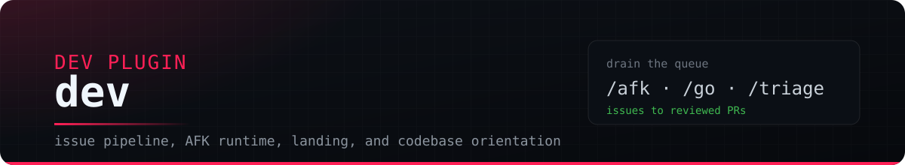
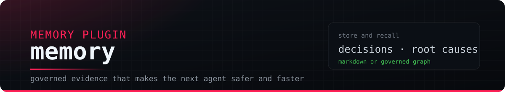
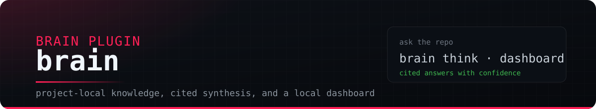

# RedSkills

Skills, agent instructions and declarative marketplace definitions for Claude Code,
Codex, Gemini, Pi, OpenCode, RedCode and Hermes.

Runtime software lives in [reddb-io/redskilled](https://github.com/reddb-io/redskilled):
MCP servers, daemon, apps, tunnel, IDE integrations, hooks, installers and all
package publishing. Existing npm package names remain unchanged.

## Install

Install the exact runtime version declared in `runtime.toon` using Redskilled's
`scripts/install-runtime.sh <version>`, then register this marketplace in your host.
The `red-skills-*` commands must be on the host's PATH. Hooks and MCP declarations
invoke installed commands; they do not download software or execute repository scripts.

## Contribute

Edit `plugins/<plugin>/skills`, references, agent instructions or marketplace
metadata. This repository contains no executable implementation. Read
[CONTRIBUTING.md](CONTRIBUTING.md) for validation and coordinated changes.

The repositories have independent versions. `runtime.toon` pins the supported runtime;
Redskilled's `skills.lock.toon` pins the content revision used in its distribution.
Historical releases stay available here; new software releases are published by
Redskilled. See [the separation contract](.red/REPOSITORY-SPLIT.md).

## What Ships

Three plugins install from one marketplace. **One source tree, several hosts:**
Claude Code, Codex, Gemini CLI, OpenCode, Pi, GitHub Actions, MCP servers, and
the herdr dashboard are generated from or read the same plugin definitions and
runtime apps.

| Plugin | Job | Use it when |
| --- | --- | --- |
| [`dev`](./plugins/dev/.claude-plugin/plugin.json) | Engineering workflow: issue triage, autonomous execution, worktree safety, review-gated landing, process dashboards, runner policy, and codebase orientation. | You want an agent to plan, execute, review, or ship code work. |
| [`memory`](./plugins/memory/README.md) | Governed operational memory: decisions, validations, reasoning attempts, stale-claim checks, context packs, and skill telemetry evidence. | You want agents to stop repeating old mistakes after context resets. |
| [`brain`](./plugins/brain/README.md) | Project-local knowledge: typed artifacts, personal/project facts, sources, graph connections, search, cited answers, and dashboards. | You want durable knowledge the human may ask about later. |

Maintainer-only plugin:

| Plugin | Job | Use it when |
| --- | --- | --- |
| [`internal`](./plugins/internal/README.md) | Maintainer-only skills for operating this repository. Installable through the normal marketplace flow, but active only when `plugins.internal.enabled: true` is present. | You maintain `red-skills` itself. |

### Dev



`dev` owns the engineering workflow: issue pipeline, autonomous execution,
interactive landing, process visibility, setup/adoption checks, codebase
orientation, and three MCP servers — [`redskilled`](./plugins/dev/skills/engineering/afk/MCP.md),
[`navigator`](./apps/mcp-navigator/README.md), and [`rsp`](./apps/rsp/README.md).

Core responsibilities:

- Bootstrap RedSkills with [`red-setup`](./plugins/dev/skills/engineering/red-setup/SKILL.md).
- Maintain issue state with [`triage`](./plugins/dev/skills/engineering/triage/SKILL.md), [`to-spec`](./plugins/dev/skills/engineering/to-spec/SKILL.md), and [`to-tickets`](./plugins/dev/skills/engineering/to-tickets/SKILL.md).
- Execute delegable work with [`afk`](./plugins/dev/skills/engineering/afk/SKILL.md), or dispatch one concrete demand with [`go`](./plugins/dev/skills/engineering/go/SKILL.md).
- Land a hand-worked branch with [`retake`](./plugins/dev/skills/engineering/retake/SKILL.md) (the retired `ship` migrated there — ADR 0081).
- Resolve human gates with [`hitl`](./plugins/dev/skills/engineering/hitl/SKILL.md) or safe retries with [`retake`](./plugins/dev/skills/engineering/retake/SKILL.md).

Dev guard rails:

- When `plugins.dev.enabled: true`, the dev PreToolUse proxy enforces the
  worktree boundary for agent shell commands: `git worktree add` must target a
  registered lane under `.red/tmp/`, and branch-moving commands in the primary checkout
  (`git switch`, `git checkout <branch>`, `git checkout -b`, `git switch -c`,
  `gh pr checkout`) are blocked. Create branches through
  `git worktree add .red/tmp/worktrees/manual/<slug> -b <branch> ...` instead.
- `plugins.dev.lock.primary-branch` remains the explicit branch-lock workflow
  flag that setup writes for compatibility and base-pinning integrations.
- The dev shell-command guard is controlled by `command_guard` in
  `.red/config.yaml`. It runs from the agent `PreToolUse` hook, stays inert
  unless `plugins.dev.enabled: true`, and blocks matching shell commands before
  execution. These repo-defined rules are **additional** to the built-in
  `.red/tmp` worktree boundary above. `global` rules apply everywhere, `main`
  rules apply in the primary session scope (not specifically the Git branch
  named `main`), and `worktree` rules apply in `/afk` and `/go` worktrees
  under `.red/tmp/`. Deny rules
  support `regex:<pattern>`, `prefix:<literal>`, `suffix:<literal>`,
  `exact:<literal>`, and `glob:<pattern>`. Bare entries with `*`, `?`, or `[`
  are Bash globs; other bare entries match the exact command, a command prefix,
  or a command suffix at a shell-command boundary. `command_guard.deny` remains
  a legacy alias for `command_guard.global`.

Example policy, not a default:

```yaml
command_guard:
  global:
    - "rm -Rf /*"
    - "git stash"
    - sudo
    - 'regex:(^|[;&|[:space:]])curl[[:space:]].*\|[[:space:]]*sh'
  main:
    - "git rebase"
    - "git checkout -b"
  worktree:
    - "git clean"

plugins:
  dev:
    enabled: true
```

### Memory



`memory` is governed operational memory for code agents. **Memory is evidence,
not vibes.** It stores work evidence that can make future agents safer and
faster: decisions, root causes, validation evidence, reasoning attempts,
stale-claim checks, readiness, handoffs, and skill telemetry evidence — so a
future agent can verify an old claim before acting on it.

Memory modes:

| Mode | Storage | Best for |
| --- | --- | --- |
| `markdown-only` | Plain notes under `.red/memory/notes/`. | Low-risk rollout with explicit store/recall only. |
| `graph` | Project-local RedDB store at `.red/memory/graph.rdb`. | Governed recall, provenance, supersession, readiness, context packs, Workbench, MCP/HTTP, and Skill telemetry. |

Memory is not the Personal-fact store. Personal facts belong in Brain, not Memory.
Broad human-facing project knowledge belongs in Brain too.

Start with [plugins/memory/README.md](./plugins/memory/README.md).

### Brain



`brain` is a project-local knowledge repository under `.red/brain/*`. It stores
typed artifacts and graph connections for later search and cited synthesis.

Use Brain for:

- Personal facts, durable preferences, identity context, and relationship notes.
- Project notes, decisions, ideas, questions, sources, bookmarks, and meeting
  residue.
- `brain think` cited answers with confidence and missing-evidence signals.
- `brain dashboard` local summaries and KPI-style views.
- Optional outbound channel actions through the Brain channel bridge.

Start with [plugins/brain/README.md](./plugins/brain/README.md).

