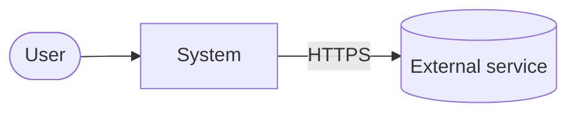
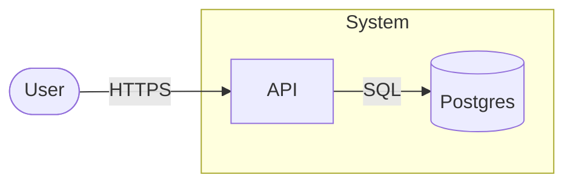
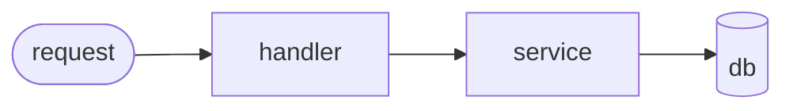

# C4 Diagram — reference

How to build and maintain the wiki's C4 model. The `wiki` skill decides *when* C4 work triggers (the Ingest C4-awareness step and the Lint C4-staleness check own those conditions); this file describes *how* to write it.

Optional, complexity-gated. When the system has enough moving parts that one person can't keep the architecture in their head — typically **≥3 services / containers** or any non-trivial cross-system integration — maintain a [C4 model](https://c4model.com) at `.red/wiki/C4.md`. It is the single architectural map for the project; every other wiki page that touches structure references it. The wiki never auto-creates `C4.md` — when a trigger fires and the file is absent, propose creation; once it exists, keep it current.

## Structure

The Mermaid block stays minimal (it is just a rendering aid). The **prose around it carries the full C4 content** — actor/system/container/component names, responsibilities, technology choices, relationship semantics.

````markdown
# C4 — <system name>

<one-line description, using the canonical system name from .red/CONTEXT.md>

updated: <YYYY-MM-DD>
context: ../CONTEXT.md   _(this file is bound to the glossary — every label below must match)_

## Level 1 — Context



**Actors**

- **User** _(from CONTEXT.md)_ — <responsibility, what they want from the system>.

**Systems**

- **System** _(from CONTEXT.md)_ — <purpose, in one sentence>.
- **External service** _(from CONTEXT.md)_ — <what it provides, why we depend on it>.

**Relationships**

- User → System: <how they interact, protocol, frequency>.
- System → External service: <calls made, data exchanged, failure mode>.

## Level 2 — Container



**Containers (inside System)**

- **API** _(from CONTEXT.md)_ — <responsibility>. Tech: <language, framework>. Owner: <team / module>.
- **Postgres** _(from CONTEXT.md)_ — <what it stores>. Tech: <version, hosting>.

**Relationships**

- User → API: <protocol, auth, payload shape>.
- API → Postgres: <connection style, transaction discipline>.

## Level 3 — Component _(per container; only where complexity warrants)_

### API _(from CONTEXT.md)_



**Components**

- **Handler** _(from CONTEXT.md)_ — <HTTP-facing layer, validation, auth>.
- **Service** _(from CONTEXT.md)_ — <domain logic, orchestration>.
- **Repo** _(from CONTEXT.md)_ — <persistence layer, queries owned>.

**Relationships**

- Handler → Service: <DTO shape, sync/async>.
- Service → Repo: <which methods, transactional boundary>.

## Notes

- <decisions, assumptions, gaps, "to-be-decided" items — same vocabulary as above>
- New terms surfaced during diagramming that need a CONTEXT.md entry: <list, or "none">.
````

The Mermaid syntax is intentionally simple — `flowchart` (universally rendered by every Mermaid viewer including GitHub), not `C4Context` / `C4Container` / `C4Component` (experimental, breaks in many renderers). Shape conventions: `[box]` for system/container/component, `([rounded])` for actor, `[(cylinder)]` for datastore, `subgraph` for "lives inside". The diagram is the index; the prose is the substance.

Level 4 (Code) is intentionally omitted — derive it from the source on demand.

## Vocabulary discipline

Every name used in the diagram and the prose must match a term already defined in `.red/CONTEXT.md`. If you find yourself writing a name in `C4.md` that is not in the glossary, stop and update the glossary first, then reference it here. The C4 inherits its words from CONTEXT — never the other way around. A term invented inside `C4.md` without a glossary entry is a contradiction the next lint pass will flag.

Bump the `updated:` frontmatter on every meaningful edit. The Lint staleness check uses that field to decide whether sources have outpaced the diagram.
