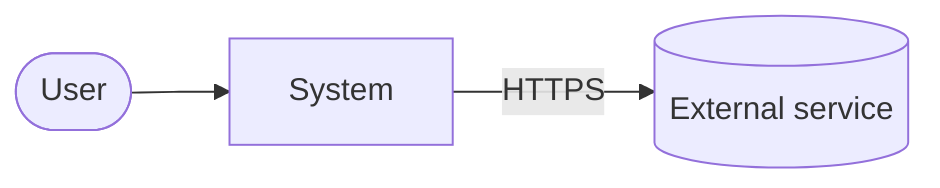
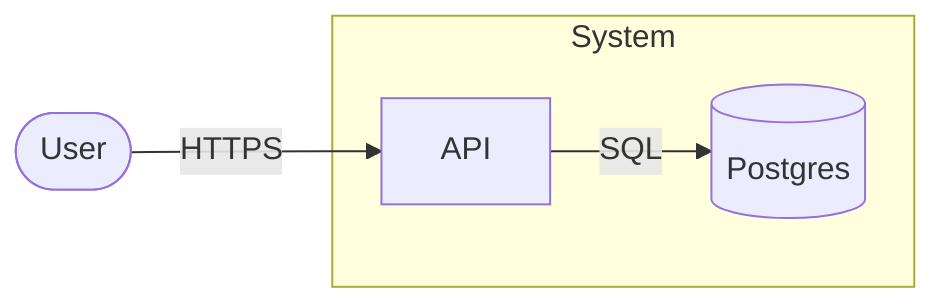
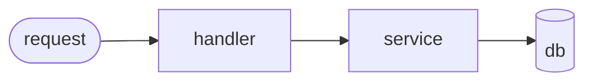

# wiki

**Operate the LLM Wiki — ingest a source, query for answers, or lint for contradictions — reading `.red/agents/wiki.md` first (source of truth for this repo's conventions).**

## Preconditions

- `.red/wiki/` exists.
- `.red/agents/wiki.md` exists.
- `.red/wiki/` is in `.gitignore` (verify before any operation that writes).

If any of those fails, stop and tell the user to run `/wiki-init`.

## Routing

Map the opening verb to an operation; if ambiguous, ask which one:

- "ingest …" / "add source …" → **Ingest**
- question words / free-form question → **Query**
- "lint" / "health check" → **Lint**

## Ingest

### 1. Resolve the input

- **URL** → `WebFetch` the content, slugify the title (kebab-case), save to `.red/wiki/raw/<slug>.md` with a minimal YAML header (`url:`, `fetched:`, `title:`). Linked images: download to `.red/wiki/raw/assets/<slug>-<n>.<ext>` and rewrite the refs.
- **Local path (PDF)** → `pdftotext <pdf> .red/wiki/raw/<slug>.txt` (or similar), then normalise to md at `raw/<slug>.md`. Keep the original PDF alongside.
- **Local path (md/txt)** → copy/move to `raw/<slug>.md` if it isn't already there.

### 2. Read and discuss

`Read` the source. Before writing pages, discuss the 3–5 main takeaways with the user. Ask about emphasis: "highlight X or Y more?".

### 3. Write pages

Use the templates in [../wiki-init/](../wiki-init/):

1. **Source page** — `pages/<slug>.md`, `type: source`. Bullets, key claims, quotes, "touches" filled in at the end.
2. **Entity pages** — one for each new person/place/object. Slug kebab-case. If a page already exists, **update** it: add to `sources:`, revise `Overview`, update `updated:`, add new facts.
3. **Concept pages** — same approach.
4. **Contradictions** — if a claim conflicts with an existing page, **do not silence it**. Add a `## Contradictions` section on the affected page citing both sides.

### 4. Update index.md

Add or update entries in the right sections. Alphabetical order within each section. Each entry: `[Title](./pages/slug.md) — one-liner. N sources.`

### 5. Log

Append to `.red/wiki/log.md`:

```markdown
## [YYYY-MM-DD] ingest | <Source title>
- source: raw/<slug>.md
- touched: pages/a.md, pages/b.md, pages/c.md
- notes: <one line on the most important change>
```

### 6. C4 awareness (optional, complexity-gated)

If `.red/wiki/C4.md` exists, check whether the new source introduces a service, integration, or dependency not yet on the diagram. If so, update C4.md and bump its `updated:` field. If the project doesn't yet have a C4 but the new source describes enough architectural surface to warrant one (≥3 services or non-trivial integration), propose creating it — see *C4 Diagram* below.

### 7. Verify gitignore

Before finishing: confirm `.red/wiki/` is still in `.gitignore`. If it was removed, alert and re-add.

## Query

### 1. Map

`Read` `.red/wiki/index.md`. Identify candidate pages by title and one-liner. If nothing matches, fall back to `grep -ri "<term>" .red/wiki/pages/` or `ripgrep`.

### 2. Drill

`Read` the candidate pages. Follow cross-links if a page cites another relevant one.

### 3. Synthesise

Pick the most useful output format:

- **Markdown prose** — for open-ended questions.
- **Markdown table** — for comparisons or structured lists.
- **Mermaid diagram** — for relationships, timelines, flows.

Other formats (slides, charts) — only on explicit request. The agent can improvise but it's not the default.

Every answer cites the pages (and via them the sources) used. Format: `(via [page-x](./pages/page-x.md))`.

### 4. File back?

If the answer has durable value (a fresh analysis, a non-obvious comparison, a timeline), ask: "file as a `synthesis` page?" If yes:

1. Create `pages/<slug>.md` with `type: synthesis` and the appropriate template.
2. Update `index.md`.
3. Append log: `## [date] query | "<question>" → answer-filed: pages/<slug>.md`.

If it isn't worth a page, just append to the log: `## [date] query | "<question>"`.

## Lint

Runs checks against `.red/wiki/`. **Does not auto-fix** — reports and asks what to do.

### Checks

1. **Contradictions** — scan pages; flag pairs that assert conflicting things. Look for: negations ("X is Y" in one, "X is not Y" in another); different numbers for the same attribute; conflicting dates.

2. **Stale** — pages whose `updated:` is >90 days old and whose referenced `sources:` have `created:` more recent than the page's `updated:` (or whose sources have been superseded by newer sources on the same topic via tags).

3. **Orphans** — pages with no inbound link (`grep -l "./<slug>.md" .red/wiki/pages/` returns empty).

4. **Stubs** — pages with `< 10` lines of content (after the frontmatter).

5. **Missing concepts** — terms repeated `>= 5x` across pages but lacking a page of their own (heuristic: lowercase + frequent bigrams/trigrams).

6. **Gaps** — questions in "Open questions" unresolved for `>60` days.

7. **C4 staleness** — if `.red/wiki/C4.md` exists, flag when its `updated:` is older than the most recent `created:` of any source page whose `touches:` list names a container or component appearing in the diagram. Suggested action: regenerate the affected level.

### Output

Markdown report grouped by the checks above. For each item:

- Path of the affected page(s).
- Detail (e.g. "claim X in pages/a.md vs claim Y in pages/b.md").
- Suggested action (e.g. "consolidate into pages/a.md, cite both sources").

Append to log: `## [date] lint — orphans: N, stale: N, contradictions: N, stubs: N, gaps: N`.

## C4 Diagram

Optional, complexity-gated. When the system has enough moving parts that one person can't keep the architecture in their head — typically **≥3 services / containers** or any non-trivial cross-system integration — maintain a [C4 model](https://c4model.com) at `.red/wiki/C4.md`. It is the single architectural map for the project; every other wiki page that touches structure references it.

### When to create

The wiki does not auto-create `C4.md`. Trigger conditions:

- During **ingest**, the new source describes architectural surface not yet captured.
- During **query**, the user asks an architecture question and no C4 exists.
- The user explicitly asks ("draw the C4", "diagram the system", "where does X fit").

When any trigger fires and `C4.md` is absent, propose creation. Once it exists, keep it current.

### Structure

The Mermaid block stays minimal (it is just a rendering aid). The **prose around it carries the full C4 content** — actor/system/container/component names, responsibilities, technology choices, relationship semantics. Every name used in the diagram and the prose must match a term already defined in `.red/CONTEXT.md`; if a name is missing from the glossary, add it there first, then reference it here.

````markdown
# C4 — <system name>

<one-line description, using the canonical system name from .red/CONTEXT.md>

updated: <YYYY-MM-DD>
context: ../CONTEXT.md   _(this file is bound to the glossary — every label below must match)_

## Level 1 — Context



**Actors**

- **User** _(from CONTEXT.md)_ — <responsibility, what they want from the system>.

**Systems**

- **System** _(from CONTEXT.md)_ — <purpose, in one sentence>.
- **External service** _(from CONTEXT.md)_ — <what it provides, why we depend on it>.

**Relationships**

- User → System: <how they interact, protocol, frequency>.
- System → External service: <calls made, data exchanged, failure mode>.

## Level 2 — Container



**Containers (inside System)**

- **API** _(from CONTEXT.md)_ — <responsibility>. Tech: <language, framework>. Owner: <team / module>.
- **Postgres** _(from CONTEXT.md)_ — <what it stores>. Tech: <version, hosting>.

**Relationships**

- User → API: <protocol, auth, payload shape>.
- API → Postgres: <connection style, transaction discipline>.

## Level 3 — Component _(per container; only where complexity warrants)_

### API _(from CONTEXT.md)_



**Components**

- **Handler** _(from CONTEXT.md)_ — <HTTP-facing layer, validation, auth>.
- **Service** _(from CONTEXT.md)_ — <domain logic, orchestration>.
- **Repo** _(from CONTEXT.md)_ — <persistence layer, queries owned>.

**Relationships**

- Handler → Service: <DTO shape, sync/async>.
- Service → Repo: <which methods, transactional boundary>.

## Notes

- <decisions, assumptions, gaps, "to-be-decided" items — same vocabulary as above>
- New terms surfaced during diagramming that need a CONTEXT.md entry: <list, or "none">.
````

The Mermaid syntax is intentionally simple — `flowchart` (universally rendered by every Mermaid viewer including GitHub), not `C4Context` / `C4Container` / `C4Component` (experimental, breaks in many renderers). Shape conventions: `[box]` for system/container/component, `([rounded])` for actor, `[(cylinder)]` for datastore, `subgraph` for "lives inside". The diagram is the index; the prose is the substance.

Level 4 (Code) is intentionally omitted — derive it from the source on demand.

**Vocabulary discipline.** If you find yourself writing a name in C4.md that is not in `.red/CONTEXT.md`, stop and update the glossary first. The C4 inherits its words from CONTEXT — never the other way around. A term invented inside C4.md without a glossary entry is a contradiction the next lint pass will flag.

### When to update

`C4.md` stays in sync **opportunistically**, not on every commit. Trigger an update when:

1. An **ingest** step introduces a new service, dependency, or integration not yet shown.
2. A **query** about architecture surfaces a contradiction between the answer and the diagram.
3. **Lint** flags `C4 staleness` (Lint check #7 above).
4. A code change visibly shifts the boundaries — new container, removed service, renamed component.

Bump the `updated:` frontmatter on every meaningful edit. The Lint staleness check uses that field to decide whether sources have outpaced the diagram.

## Anti-patterns

- ❌ Never operate without reading `.red/agents/wiki.md` first.
- ❌ Never edit `raw/` — it is immutable.
- ❌ Never silence contradictions — surface them.
- ❌ Never use wikilinks `[[...]]` — use standard markdown `[...](./...)`.
- ❌ Never commit `.red/wiki/` — verify `.gitignore` before any `git add`.

## References

- [LLM Wiki — Karpathy gist](./REFERENCES.md#karpathy-llm-wiki) — origin of the pattern.
- [Memex — Vannevar Bush, 1945](./REFERENCES.md#memex) — proto-LLM-wiki.
- [Tolkien Gateway](./REFERENCES.md#tolkien-gateway) — example of incremental human wiki.
- [qmd](./REFERENCES.md#qmd) — local search engine for md, optional.
- [Obsidian Dataview](./REFERENCES.md#obsidian-dataview) — dynamic queries via frontmatter.
